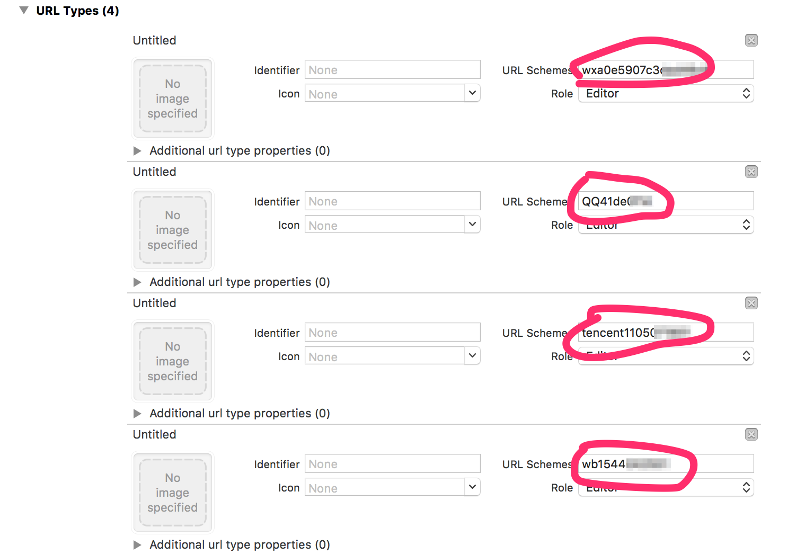

# STShareTool

常见的社会化分享，包含（QQ、QQ控件、微信好友、微信朋友圈、新浪微博、短信、邮箱）

没有一次和三方打交道是愉快的，尤其是三方分享、三方登录、三方支付、三方地图等等。这些都是非常常用的组件，iOS9 出来以后，又对安全性做了要求，配置相当繁琐，所以干脆封装了，记录一下流程。

## 申请 AppKey

第一步就是先去各个平台上申请 AppKey。

### QQ 开放平台

[http://open.qq.com](http://open.qq.com)

该平台申请的包含 QQ 和 QQ 空间。暂时没发现有什么需要注意的地方。

### 微信开放平台

[http://open.weixin.qq.com](http://open.weixin.qq.com)

该平台申请的包含 微信好友 和 微信朋友圈。

### 微博开放平台

[http://open.weibo.com](http://open.weibo.com)

呵呵呵呵呵呵，最坑的就是微博了好吗。

-   记着文案要符合要求：应用的作用、使用方法什么的。
-   应用地址，如果还没上线的话，可以先用默认 URL 占位：https://itunes.apple.com/cn/genre/yin-le/id34。
-   设置安全域名为：sns.whalecloud.com。
-   应用介绍图片，记着要有【新浪微博】的标示（icon 什么的，表示该页面有分享）。
-   在应用信息->高级信息里面，将授权回调和取消授权回调设置为：http://sns.whalecloud.com/sina2/callback。

### 友盟

[http://www.umeng.com](http://www.umeng.com)

## 工程配置

### 导入库

-   ImageIO.framework
-   libz.tbd
-   libstdc++.tbd
-   CoreTelephony.framework
-   libsqlite3.tbd
-   CoreGraphics.framework
-   SystemConfiguration.framework
-   libiconv.tbd
-   Security.framework

### 配置 Build Setting

找到 Other Linker Flags ，添加两项 -all_load 和 -ObjC。要不然会报 wb…base64...的错，运行就崩溃好吗。

配置完，别忘了 Clean 一下，防止有缓存。

### 配置 URL Types

点击工程名称，找到 info 选项卡，找到最后的 URL Types 。

添加四个 URL Types。分别是 QQ 、微信、微博。（ 对 QQ 要配置两个，所以三个平台要有四个 URL Types...

只用填写 URL Schemes 就行，规则如下：

-   微信：直接是微信的 AppId。
-   QQ1：【QQ + QQ 的 AppId 的[十六进制](http://tool.oschina.net/hexconvert/)（不足8位前面补0）】
-   QQ2：【tencent + AppId】
-   微博：【wb + 微博的 AppKey】

配置好以后，大概是这样的：



### 配置 info.plist

-   设置 Bundle display name ，这会在应用见跳转和分享的时候显示。
-   设置 App Transport Security Settings ，我设置的 Allow Arbitrary Loads 为 YES，当然你也可以逐个添加白名单。
-   设置 LSApplicationQueriesSchemes。这个我就直接贴 Source Code 了

``` 
<key>LSApplicationQueriesSchemes</key>
	<array>
		<string>weibosdk2.5</string>
		<string>weibosdk</string>
		<string>mqqapiwallet</string>
		<string>mqqwpa</string>
		<string>mqqbrowser</string>
		<string>wtloginmqq2</string>
		<string>mqqOpensdkSSoLogin</string>
		<string>mqqopensdkapiV2</string>
		<string>mqqopensdkapiV3</string>
		<string>mqqapi</string>
		<string>mqq</string>
		<string>sinaweibo</string>
		<string>wechat</string>
		<string>mqzone</string>
		<string>weixin</string>
	</array>
```

## 友盟

通用的一些配置就到这了，下面是对本工具的介绍。

首先，我是在友盟基础上进行封装的。所以，要先去下载最新版的[友盟 SDK ](http://dev.umeng.com/social/ios/sdk-download)。

## STShareTool 使用

首先，在 `STShareTool.h` 中配置各种 key

``` objective-c
static NSString * const STShareImageKey = @"STShareImageKey"; ///< 分享图片的 key （传入的是字典，所以这个作为key）（image 是 UIImage）
static NSString * const STShareContentKey = @"STShareContentKey"; ///< 分享内容的 key （content 是 NSString 的）
static NSString * const STShareURLKey = @"STShareURLKey"; ///< 分享 url 的 key （url 是 NSString 的）

static NSString * const STShareTitle = @"SwiftGG"; ///< 分享的标题
static NSString * const STShareURL = @"http://www.swift.gg"; ///< 分享的url，实际没用到，写在这占位

static NSString * const STShareQQAppId = @"";
static NSString * const STShareQQAppKey = @"";

static NSString * const STShareWeiboAppKey = @"";
static NSString * const STShareWeiboAppSecret = @"";
static NSString * const STShareWeiboCallbackURL = @"http://sns.whalecloud.com/sina2/callback"; ///< 微博回调的 url，就是微博申请高级信息里面那个

static NSString * const STShareWechatAppId = @"";
static NSString * const STShareWechatAppSecret = @"";

static NSString * const STShareUMAppKey = @"";
```

### 调用

#### 实例化 STShareTool

界面搞定以后，初始化 `STShareTool` 对象：

```objective-c
self.shareTool = [STShareTool toolWithViewController:self];
```

需要传入一个 `UIViewController` 对象，因为短信和邮件分享需要 view controller 推出界面。

#### 分享的方法列表

``` objective-c
- (void)shareToQQ:(NSDictionary *)shareContent;
- (void)shareToQZone:(NSDictionary *)shareContent;
- (void)shareToWeChatSession:(NSDictionary *)shareContent;
- (void)shareToWeChatTimeline:(NSDictionary *)shareContent;
- (void)shareToWeibo:(NSDictionary *)shareContent;
- (void)shareToMail:(NSDictionary *)shareContent;
```

#### 分享

```objective-c
NSDictionary *shareContent = @{STShareContentKey : @"SwiftGG 最帅",
                               STShareImageKey : [UIImage imageNamed:@"60"],
                               STShareURLKey : @"http://www.swift.gg"};
[self.shareTool shareToQQ:shareContent];
```

因为名字都是 `shareTo...`，所以可以用 `performSelector:` 来调用。

#### 短信与邮件分享

因为可能出现系统不支持短信，或未配置邮箱的情况，所以仅在以下情况能发送：

```objective-c
[MFMessageComposeViewController canSendText]; // 支持短信
[MFMailComposeViewController canSendMail]; // 支持邮箱
```

因为以上分享的方法并没有返回值，所以如果不支持邮箱，就需要自己外部判断，`STShareTool` 提供判断是否支持邮箱的类方法：

```objective-c
+ (BOOL)canSendMail;
```

自行判断是否支持邮箱：

```objective-c
if (![STShareTool canSendMail]) {
    [[[UIAlertView alloc] initWithTitle:@"提示" message:@"请配置邮箱" delegate:nil cancelButtonTitle:@"确认" otherButtonTitles:nil] show];
    return;
}
```

## 回调

在未安装微博的情况下，如果出现点击分享，跳转 Web 微博，点击关闭返回 app 时 crash 这个问题。那么在 appdelegate 中实现以下两个回调方法即可（貌似是因为友盟版本不同，未安装微博的处理方式也不同，如果出现这个问题，就用以下方法好了）：

```objective-c
- (BOOL)application:(UIApplication *)application openURL:(NSURL *)url sourceApplication:(NSString *)sourceApplication annotation:(id)annotation{
    return YES;
}

- (BOOL)application:(UIApplication *)application handleOpenURL:(NSURL *)url{
    return YES;
}
```

多谢 [@CMB](https://github.com/chenmingbiao) 发现并解决的这个问题。

## 最后

三方分享还有问题吗？有问题提 issue 啊！